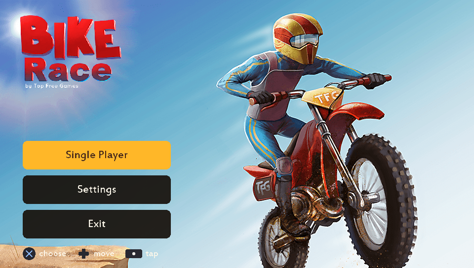
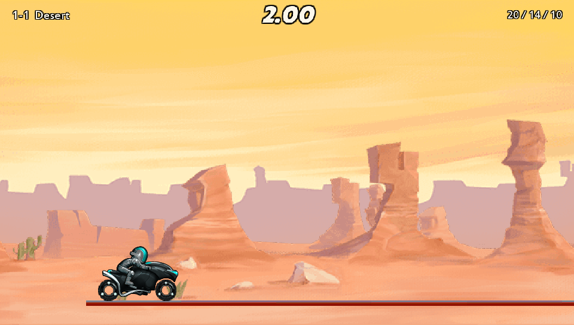

# Bike Race — PS Vita



A from-scratch port of *Bike Race Pro 4.3* (Top Free Games, 2014) to the
PlayStation Vita and PlayStation TV.

The original ships no native code at all. It's Java on a `GLSurfaceView`, so
there was nothing at the ABI level to hook or wrap. This is a full rewrite in
C, built against the decompiled sources and rendered through vitaGL. The
physics is copied over quirks and all: a point-mass-and-spring model that was
never a real solver, kept exactly as it was because reproducing it precisely
is what makes the game still feel like itself.



- All 19 worlds, 152 levels, built straight from the original's own level
  factories.
- 60 FPS, vsync locked.
- Runs on PS Vita and PlayStation TV. Touch works everywhere but isn't
  required anywhere; every tap has a button next to it.
- Ghost replays: your best run on a level plays back beside you, faded out.
- Progress, star gating and best times, following the original's own rules.
- A controller-first interface, since the original was touch-only and shipped
  no button prompts at all.

## Controls

| | |
|---|---|
| Accelerate | Cross, or the right half of the touchscreen |
| Brake / reverse | Square, or the left half of the touchscreen |
| Lean forward (nose down) | R, left stick right, or d-pad right |
| Lean back (wheelie) | L, left stick left, or d-pad left |
| Reset the level | Circle |
| Pause | Start |
| Menus: move, choose, back | d-pad or stick; Cross; Circle |
| Bike list | Triangle |
| Quit | Exit, on the start screen |

There's no tilt or gyro control. The Android original steered with the
accelerometer; here that range maps onto the triggers and the left stick
instead, which turns out more precise anyway and is the only option a
PlayStation TV has to begin with.

---

## Legal

**This repository contains no copyrighted game code, artwork, audio, or APK.**
What's here is the C source of an independent reimplementation, plus scripts
that pull data out of a copy of the original game that you supply yourself.

It does not contain, and never will contain:

- the APK, or any part of it
- `classes.dex`, or any Java decompiled from it
- the game's textures, sprites, audio or fonts
- `data/levels.bin` or `data/font_*.bin`, the level geometry and font atlases
  baked out of the original. These are required to build, and are generated
  locally, from your own copy of the APK, by `scripts/dumplevels.sh` and
  `scripts/makefonts.sh`.

Two things here *are* derived from the original and are included on purpose,
because a Vita homebrew package can't work or be documented without them:

- `sce_sys/`, the LiveArea icon and background built from the game's own art.
  These get baked into the `.vpk` so the app has an icon on the home screen.
- `tests/shots/`, screenshots of the running game used as visual regression
  references by `make -C tests shots`.

This project isn't affiliated with, endorsed by, or connected to Top Free
Games. *Bike Race* and its artwork are still theirs. You need to own the
original game to use this port; without a copy of it, the port does nothing.

---

## Installing

You need the original 2014 APK. The port reads the game's art and audio off
the memory card at runtime; it ships none of it.

### 1. Install the VPK

Grab `BikeRace.vpk` from the [Releases](../../releases) tab, copy it to your
Vita (VitaShell over FTP or USB), press Cross on it and confirm the install.

No kernel plugins needed here. This is a native vitaGL build, not an `.so`
loader port, so `kubridge` and `fd_fix` don't apply.

### 2. Get the original APK

Download *Bike Race* 4.3 (`com.topfreegames.bikeraceproworld`, 2014):

<https://bike-race.en.uptodown.com/android/download/122951516>

Rename `.apk` to `.zip` and extract it.

### 3. Convert the assets

You can't just copy the APK's files across. There's no usable `assets/` folder
in it: the art sits in `res/drawable-nodpi` and `res/drawable-xhdpi`, the
audio is in `res/raw` as MP3s and as WAVs at sample rates the Vita's mixer
won't take, and three of the wheel sprites only exist as regions cropped out
of a bigger atlas. A script handles all of it:

```sh
git clone https://github.com/franciscoclou/bikerace-vita.git
cd bikerace-vita
mkdir apk && unzip /path/to/bike-race.zip -d apk
./scripts/extract_assets.sh
```

This needs `ffmpeg`, `imagemagick` and `python3` with Pillow. It writes
`assets_out/`, about 24 MB.

### 4. Copy the assets to the Vita

Copy everything *inside* `assets_out/` (not the folder itself) into
`ux0:data/bikerace/` with VitaShell, so you end up with:

```
ux0:data/bikerace/textures/
ux0:data/bikerace/ui/
ux0:data/bikerace/sfx/
ux0:data/bikerace/music/      <- optional, 8.8 MB menu track
```

The menu music is the largest single file, and the game runs fine without it.

Launch it from the LiveArea. Progress is saved to
`ux0:data/bikerace/save.bin`, and ghost replays to `ghosts.bin` beside it.

---

## Building

The toolchain runs in Docker, so nothing else needs installing:

```sh
./scripts/setup.sh      # jadx, vita-parse-core, the vitasdk image
./scripts/decompile.sh  # jadx over apk/classes.dex
./scripts/dumplevels.sh # -> data/levels.bin   (19 worlds, 152 levels)
./scripts/makefonts.sh  # -> data/font_*.bin
./scripts/build.sh      # -> build/BikeRace.vpk
```

The first four steps all need `apk/` in place; see step 2 above.

`make -C tests run` compiles the game's own sources natively, with GL and the
logger stubbed, and runs the real physics over all 152 levels. It runs twice:
once as a handheld, once as a PlayStation TV.

### While developing

```sh
./scripts/log.sh            # live UDP debug log -> debug.log
./scripts/getdump.sh        # pull the newest crash dump off the Vita
./scripts/parsedump.sh      # symbolise it against build/bikerace
./scripts/find.sh <Class>   # locate decompiled Java by original class name
./scripts/deploy.sh         # print the curl commands to copy a build over
```

The Vita has no console, so the game sends every log line as a UDP datagram to
your PC and mirrors it to `ux0:data/bikerace/debug.log`, which survives a
crash that takes the network with it.

Network addresses, title id and paths live in
[scripts/env.sh](scripts/env.sh). Override them in `scripts/env.local.sh`
(gitignored) rather than editing a tracked file.

[docs/ARCHITECTURE.md](docs/ARCHITECTURE.md) explains how the engine fits
together, and [docs/PORTING.md](docs/PORTING.md) tracks what's done.

---

## Credits

- [VitaSDK](https://vitasdk.org/), the open toolchain this whole thing is
  built with.
- [Rinnegatamante](https://github.com/Rinnegatamante) for
  [vitaGL](https://github.com/Rinnegatamante/vitaGL), the GXM-backed OpenGL
  implementation this port renders through. Its fixed-function path lines up
  almost exactly with what the original's engine expected.
- [TheOfficialFloW](https://github.com/TheOfficialFloW) and Rinnegatamante
  again, for the packaging, asset-layout and debugging conventions most Vita
  homebrew ports follow, this one included. (Their `.so` loader work doesn't
  apply here, since the original never had a native library to load, but the
  conventions around it do.)
- Top Free Games, for the original game.

## Licence

The C source here is MIT licensed. That covers the port only, not *Bike Race*
itself or anything extracted from it.
